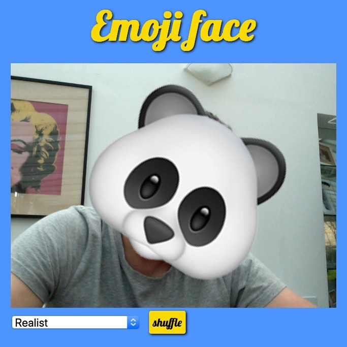

# Emoji Face

A web application based on [p5.js](https://p5js.org/) + [ml5.js](https://ml5js.org/) that displays an emoji on top of your head, captured by your webcam.

Try the live [demo](https://oliviernocent.github.io/emoji-face/).
